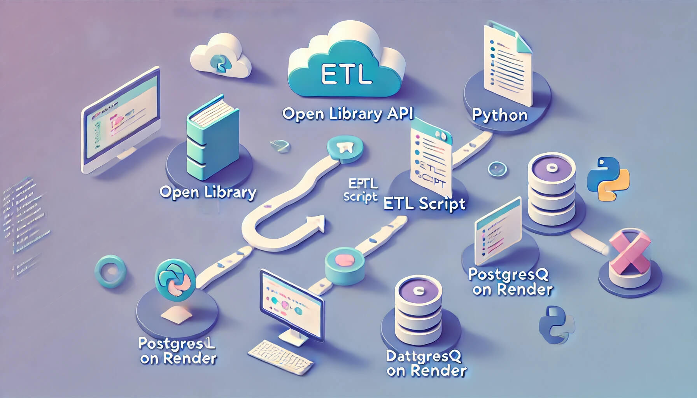
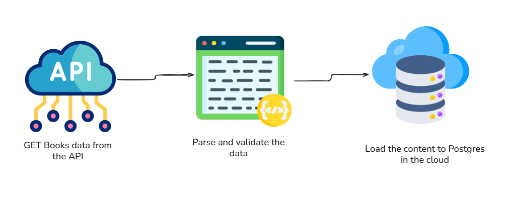

# 📚 Open Library Data Pipeline

A simple, cloud-based data pipeline that extracts book data from the [Open Library API](https://openlibrary.org/developers/api), transforms and loads it into a PostgreSQL database hosted on [Render](https://render.com/), and makes the data accessible via DBeaver for analysis and exploration.


---

## 🔄 Pipeline Overview



---

## 🛠️ Tech Stack

| Component        | Description                                                 |
|------------------|-------------------------------------------------------------|
| **Open Library API** | Source of book data, including metadata and subjects      |
| **Python (ETL Script)** | Script to extract, transform, and load (ETL) data         |
| **PostgreSQL on Render** | Cloud-hosted relational database for structured storage |
| **DBeaver**       | Database viewer for querying and analyzing the data         |

---

## 📦 Project Structure

open-library-etl/<br>
├── README.md # Project documentation<br>
└── img/<br>
└── pipeline-diagram.png # Infographic of the pipeline<br>
└── scripts/<br>
├── etl_script.py # Main ETL script<br>
---

## ⚙️ How It Works

1. **Extract**  
   The Python script makes HTTP GET requests to the Open Library API, pulling data such as titles, authors, publish years, and subjects.

2. **Transform**  
   The data is cleaned, normalized, and structured into table-friendly formats.

3. **Load**  
   Cleaned data is inserted into a PostgreSQL database hosted on Render.

4. **Visualize**  
   DBeaver connects to the PostgreSQL database to query and explore the data.

---

## 🚀 Running the Project

### Prerequisites

- Python 3.8+
- PostgreSQL database on Render
- DBeaver installed locally
- `pandas` >= 2.2.3
- `psycopg2` >= 2.9.10
- `requests` >= 2.32.3
- `sqlalchemy` >= 2.0.41

#### Close the Repository

```bash
git clone https://github.com/gurezende/Books-Pipeline.git
```


#### Install Dependencies

```bash
pip install pandas sqlalchemy psycopg2 requests
```

#### Set Up Environment Variables

Create a `.env` file:
```ini
DB_HOST = "dpg-xxxxxxx.render.com"
DB_NAME = "<your-database-name>"
DB_USER = "<your-database-user>"
DB_PASSWORD = "<your-database-password>"
```

#### Run the ETL Script

```bash
python `scripts/etl_script.py
```

## 📊 Example Use Cases

Query books by subject or author <br>
Generate reading recommendations <br>
Visualize publishing trends over time

## 🖼️ Demonstration

<p align="center">  </p>

## 📄 License

This project is licensed under the MIT License.

## About the Author

Project developed by **Gustavo R Santos**. <br>
[Visit my website](https://gustavorsantos.me)